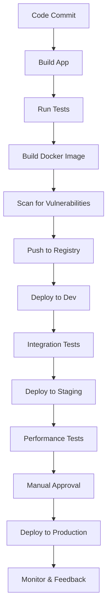

# 06. Continuous Delivery 🚀

[<- Back to DevOps Culture and Practices](./05-devops.md) | [Back to Main Note](./README.md)

## Table of Contents

- [Understanding CI/CD](#understanding-cicd)
- [CI/CD Pipeline Components](#cicd-pipeline-components)
- [Implementing CI/CD for Docker Applications](#implementing-cicd-for-docker-applications)
- [GitHub Actions for Container Workflows](#github-actions-for-container-workflows)
- [GitHub Packages for Docker Images](#github-packages-for-docker-images)
- [Best Practices](#best-practices)
- [Real-World Considerations](#real-world-considerations)

## Understanding CI/CD

Continuous Integration (CI) and Continuous Delivery/Deployment (CD) form the backbone of modern software delivery:

### Continuous Integration (CI)

- **Definition**: The practice of frequently merging code changes and automatically verifying the result
- **Key Activities**: Building code, running tests, code quality checks
- **Benefits**: Early bug detection, consistent integration process, improved code quality

### Continuous Delivery (CD)

- **Definition**: Ensuring that code is always in a deployable state by extending CI with automated deployment capabilities
- **Key Characteristic**: Every code change that passes tests is a potential release
- **Human Element**: May include a manual approval step for production deployments

### Continuous Deployment

- **Definition**: Extending continuous delivery by automatically deploying every change that passes all tests
- **Key Characteristic**: No human intervention for deployment
- **Benefit**: Faster release cycles, immediate user feedback

### The CI/CD Spectrum

The progression from traditional deployment to continuous deployment:

1. **Manual Deployment**: Entirely human-driven process
2. **Deployment Automation**: Scripts automate deployment but are manually triggered
3. **Continuous Integration**: Automated building and testing upon code commit
4. **Continuous Delivery**: Automated preparation for release, with manual approval
5. **Continuous Deployment**: Fully automated deployment pipeline

## CI/CD Pipeline Components

A typical CI/CD pipeline includes several stages:

### 1. Source Stage

- **Code Repository**: GitHub, GitLab, Bitbucket
- **Triggers**: Pull requests, commits to specific branches
- **Version Control**: Git, SVN
- **Branch Strategies**: Feature branches, trunk-based development

### 2. Build Stage

- **Compilation**: Turning source code into binaries (if applicable)
- **Dependencies**: Resolving and installing required libraries
- **Artifacts**: Creating deployable packages (JARs, Docker images, etc.)
- **Containerization**: Building Docker images with the application

### 3. Test Stage

- **Unit Tests**: Testing individual components in isolation
- **Integration Tests**: Testing interactions between components
- **Functional Tests**: Testing end-to-end functionality
- **Performance Tests**: Verifying system performance under load
- **Security Tests**: Identifying vulnerabilities and security issues

### 4. Deploy Stage

- **Environments**: Dev, Test, Staging, Production
- **Deployment Strategies**: Blue/Green, Canary, Rolling updates
- **Infrastructure**: Provisioning and configuring required resources
- **Configuration Management**: Ensuring correct settings per environment

### 5. Operate & Monitor Stage

- **Health Checks**: Verifying system functionality after deployment
- **Metrics Collection**: Gathering performance and usage data
- **Logging**: Centralizing and analyzing application logs
- **Alerting**: Notifying teams of potential issues

## Implementing CI/CD for Docker Applications

Containerized applications present unique considerations for CI/CD pipelines:

### Docker-specific Pipeline Stages

1. **Build Docker Image**: Create optimized, layered images
2. **Scan Image**: Check for vulnerabilities in the image and dependencies
3. **Push to Registry**: Store images in a container registry
4. **Deploy to Environment**: Update container orchestration platform
5. **Verify Deployment**: Health checks and smoke tests

### Example CI/CD Flow for Docker



## GitHub Actions for Container Workflows

GitHub Actions provides powerful CI/CD capabilities directly integrated with GitHub repositories:

### Basic GitHub Actions Workflow for Docker

```yaml
name: Docker Build and Push

on:
  push:
    branches: [ main ]
  pull_request:
    branches: [ main ]

jobs:
  build:
    runs-on: ubuntu-latest
    steps:
      - name: Checkout code
        uses: actions/checkout@v2
        
      - name: Set up Docker Buildx
        uses: docker/setup-buildx-action@v1
        
      - name: Login to GitHub Container Registry
        uses: docker/login-action@v1
        with:
          registry: ghcr.io
          username: ${{ github.repository_owner }}
          password: ${{ secrets.GITHUB_TOKEN }}
          
      - name: Build and push
        uses: docker/build-push-action@v2
        with:
          context: .
          push: ${{ github.event_name != 'pull_request' }}
          tags: ghcr.io/${{ github.repository }}:latest
```

### Multi-Stage Workflow

For a more complete CI/CD pipeline:

```yaml
name: CI/CD Pipeline

on:
  push:
    branches: [ main ]
  pull_request:
    branches: [ main ]

jobs:
  test:
    runs-on: ubuntu-latest
    steps:
      - uses: actions/checkout@v2
      - name: Set up Node.js
        uses: actions/setup-node@v2
        with:
          node-version: '16'
      - name: Install dependencies
        run: npm ci
      - name: Run tests
        run: npm test
        
  build-and-push:
    needs: test
    runs-on: ubuntu-latest
    if: github.event_name == 'push'
    steps:
      - uses: actions/checkout@v2
      - name: Set up Docker Buildx
        uses: docker/setup-buildx-action@v1
      - name: Login to GitHub Container Registry
        uses: docker/login-action@v1
        with:
          registry: ghcr.io
          username: ${{ github.repository_owner }}
          password: ${{ secrets.GITHUB_TOKEN }}
      - name: Build and push
        uses: docker/build-push-action@v2
        with:
          context: .
          push: true
          tags: ghcr.io/${{ github.repository }}:latest
          
  deploy:
    needs: build-and-push
    runs-on: ubuntu-latest
    steps:
      - name: Deploy to staging
        run: |
          # Deployment script or command
          echo "Deploying to staging environment"
```

## GitHub Packages for Docker Images

GitHub Packages provides a container registry directly integrated with GitHub repositories:

### Publishing to GitHub Packages

To prepare your Docker image for GitHub Packages, use the correct image naming convention in your docker-compose file:

```yaml
services:
  backend:
    build: ./backend
    image: ghcr.io/<organization>/<repository>:latest
    ports:
      - "8080:8080"
```

### Authentication for GitHub Packages

To push to GitHub Packages, you need proper authentication:

1. **Create a Personal Access Token (PAT)**:
   - Go to GitHub Settings > Developer settings > Personal access tokens
   - Generate a token with `read:packages`, `write:packages`, and `delete:packages` scopes

2. **Login to the Container Registry**:
   ```bash
   echo $CR_PAT | docker login ghcr.io -u USERNAME --password-stdin
   ```

3. **Push the Image**:
   ```bash
   docker-compose push
   ```

### Verifying PAT Permissions

To verify that your Personal Access Token (PAT) has the correct permissions, you can use a validation script:

```bash
#!/bin/bash
# is_valid_crpat.sh

TOKEN=$1

if [ -z "$TOKEN" ]; then
  echo "Usage: ./is_valid_crpat.sh <github_token>"
  exit 1
fi

# Test authentication with the token
echo "Testing authentication..."
curl -s -H "Authorization: token $TOKEN" https://api.github.com/user > /dev/null
if [ $? -ne 0 ]; then
  echo "❌ Invalid token or API rate limit exceeded"
  exit 1
fi

# Check for package permissions
echo "Checking package permissions..."
SCOPES=$(curl -s -H "Authorization: token $TOKEN" https://api.github.com/user | jq -r '.permissions')

if echo $SCOPES | grep -q '"packages": true'; then
  echo "✅ Token has packages permission"
else
  echo "❌ Token lacks packages permission"
fi

# Test container registry authentication
echo "Testing container registry authentication..."
echo $TOKEN | docker login ghcr.io -u USERNAME --password-stdin
if [ $? -eq 0 ]; then
  echo "✅ Successfully authenticated with container registry"
else
  echo "❌ Failed to authenticate with container registry"
fi

docker logout ghcr.io
```

## Best Practices

### Docker Image Optimization

- **Use multi-stage builds** to keep images small
- **Layer caching** to speed up builds
- **Minimal base images** like Alpine or distroless
- **Security scanning** as part of the pipeline

### Environment Configuration

- **Separate configurations** for different environments
- **Use environment variables** for configuration
- **Secrets management** (don't hardcode secrets)
- **Feature flags** for selective feature enabling

### Testing Strategies

- **Test in production-like environments**
- **Automated smoke tests** after deployment
- **Chaos engineering** to test resilience
- **Rollback testing** to ensure recovery works

### Deployment Strategies

- **Blue/Green Deployment**: Maintain two identical environments, switch traffic
- **Canary Releases**: Gradually roll out to a small subset of users
- **Feature Flags**: Decouple deployment from feature release
- **Rolling Updates**: Progressively update instances

## Real-World Considerations

### Security in CI/CD

- **Secure credentials**: Use secret management, not environment variables
- **Scan dependencies**: Check for vulnerabilities in libraries
- **Image scanning**: Detect vulnerabilities in container images
- **Signed commits**: Ensure code integrity
- **Least privilege**: Limit pipeline permissions

### Monitoring and Observability

- **Deployment markers**: Tag monitoring tools with deployment events
- **Automated rollbacks**: Revert deployments that fail health checks
- **Performance monitoring**: Track key metrics before and after deployment
- **Centralized logging**: Correlate logs across services

### Scaling CI/CD

- **Self-hosted runners**: For specialized hardware needs or security
- **Pipeline caching**: Speed up builds with caching
- **Parallel jobs**: Run tests and builds concurrently
- **Matrix builds**: Test across multiple platforms/configurations

### Cultural Considerations

- **Developer ownership**: Teams should own their pipeline
- **Transparent feedback**: Make build and deployment status visible
- **Blameless culture**: Focus on learning from failures
- **Continuous improvement**: Regularly refine the pipeline

---

[<- Back to DevOps Culture and Practices](./05-devops.md) | [Back to Main Note](./README.md)
