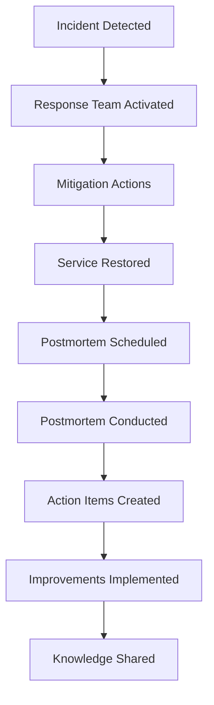

# 3. Postmortem Practices 📝

[<- Back: DevOps Culture](./02-devops-culture.md) | [Next: Continuous Deployment ->](./04-continuous-deployment.md)

## Table of Contents

- [Postmortem Definition](#postmortem-definition)
- [Blameless Postmortem Philosophy](#blameless-postmortem-philosophy)
- [Real-World Incident Examples](#real-world-incident-examples)
- [Postmortem Structure](#postmortem-structure)
- [Implementation Framework](#implementation-framework)
- [Learning Culture Integration](#learning-culture-integration)

## Postmortem Definition

### Core Concept
Document outlining steps taken to resolve an incident, focusing on systemic learning rather than individual blame.

### Purpose
- **Learning amplification** - transform incidents into knowledge
- **Process improvement** - identify and fix systemic issues
- **Knowledge preservation** - capture tribal knowledge
- **Culture reinforcement** - normalize learning from failure

### Key Principle
**Humans should be expected to fail. Systems should be designed to handle human errors, otherwise it's a failure of the system.**

## Blameless Postmortem Philosophy

### Fundamental Assumption
Human error is inevitable; system design must accommodate this reality.

### Focus Areas

**System Failures (Target):**
- Inadequate monitoring
- Missing safety mechanisms
- Poor error handling
- Insufficient documentation
- Process gaps

**Not Individual Failures (Avoid):**
- Personal blame
- Skill deficiencies
- Carelessness
- Individual mistakes

### Cloudflare Example Quote
> "We're deeply sorry for this incident: this was a failure of a number of controls, and we are prioritizing work to implement additional system-level controls related not only to our abuse processing systems, but so that we continue to reduce the blast radius of any system- or human- action that could result in disabling any production service at Cloudflare."

**Analysis:** Notice how they frame it as "failure of controls" rather than "human error."

## Real-World Incident Examples

### GitHub Incident Pattern
Based on course material screenshots, typical incident progression:

1. **Initial Detection** - Monitoring alerts triggered
2. **Impact Assessment** - Service degradation identified
3. **Investigation** - Root cause analysis begins
4. **Mitigation** - Immediate fixes applied
5. **Resolution** - Service fully restored
6. **Follow-up** - Postmortem and improvements

### Incident Timeline Structure

```markdown
## Incident Timeline

**2024-02-06 14:23 UTC** - Initial alert: API response time >2s
**2024-02-06 14:25 UTC** - On-call engineer investigating
**2024-02-06 14:32 UTC** - Database connection pool exhaustion identified
**2024-02-06 14:35 UTC** - Temporary mitigation: connection pool increased
**2024-02-06 14:45 UTC** - Service performance restored
**2024-02-06 15:30 UTC** - Root cause confirmed: memory leak in connection handling
**2024-02-06 16:00 UTC** - Permanent fix deployed
```

## Postmortem Structure

### Essential Sections

#### 1. Executive Summary
- **Impact scope** - affected services/users
- **Duration** - incident start to resolution
- **Root cause** - primary technical issue
- **Business impact** - quantified damage

#### 2. Timeline
- **Chronological events** - what happened when
- **Actions taken** - decisions and implementations
- **Communication** - stakeholder notifications

#### 3. Root Cause Analysis
- **Primary cause** - technical failure point
- **Contributing factors** - circumstances enabling failure
- **Detection gaps** - why wasn't it caught earlier

#### 4. Impact Assessment
- **Service degradation** - performance metrics
- **User experience** - customer-facing issues
- **Business metrics** - revenue/reputation impact

#### 5. Response Evaluation
- **What went well** - effective actions
- **What could improve** - response gaps
- **Response time** - detection to resolution

#### 6. Action Items
- **Immediate fixes** - prevent recurrence
- **Process improvements** - enhance response
- **Monitoring enhancements** - better detection
- **Documentation updates** - knowledge capture

### Postmortem Template

```markdown
# Postmortem: [Service] Outage - [Date]

## Executive Summary
- **Incident Duration:** [Start Time] - [End Time] ([Duration])
- **Impact:** [Brief description of user impact]
- **Root Cause:** [Primary technical cause]
- **Services Affected:** [List of affected services]

## Timeline
| Time (UTC) | Event | Actions Taken |
|------------|-------|---------------|
| 14:23 | Alert triggered | On-call notified |
| 14:25 | Investigation started | Checking logs |
| 14:32 | Root cause identified | Applying mitigation |

## Root Cause Analysis

### Primary Cause
[Detailed explanation of technical failure]

### Contributing Factors
- [Factor 1: e.g., insufficient monitoring]
- [Factor 2: e.g., deployment process gap]
- [Factor 3: e.g., documentation outdated]

## Impact Assessment

### Technical Impact
- [Service availability percentage]
- [Performance degradation metrics]
- [Data integrity status]

### Business Impact
- [User experience description]
- [Revenue impact if applicable]
- [Customer communications required]

## Response Evaluation

### What Went Well
- [Effective response actions]
- [Good communication practices]
- [Quick mitigation steps]

### Areas for Improvement
- [Detection could be faster]
- [Response process gaps]
- [Communication delays]

## Action Items

### Immediate (Complete within 1 week)
- [ ] [Owner] Fix X to prevent recurrence
- [ ] [Owner] Update monitoring for Y
- [ ] [Owner] Document Z procedure

### Short-term (Complete within 1 month)
- [ ] [Owner] Implement circuit breakers
- [ ] [Owner] Enhance alerting rules
- [ ] [Owner] Create runbook for scenario

### Long-term (Complete within 1 quarter)
- [ ] [Owner] Architectural improvement A
- [ ] [Owner] Process enhancement B
- [ ] [Owner] Training program C

## Lessons Learned
[Key insights and knowledge gained from incident]
```

## Implementation Framework

### Cultural Prerequisites
- **Psychological safety** - safe to discuss failures
- **Learning mindset** - failures as growth opportunities
- **System thinking** - focus on process over individuals
- **Continuous improvement** - iterative enhancement

### Process Integration

#### Incident Response Flow


#### Postmortem Facilitation
```javascript
// Postmortem meeting structure
const postmortemAgenda = {
  duration: '60-90 minutes',
  participants: [
    'incident_responders',
    'service_owners',
    'relevant_stakeholders'
  ],
  structure: {
    opening: {
      duration: '5 minutes',
      purpose: 'Set blameless tone, review agenda'
    },
    timeline_review: {
      duration: '20 minutes',
      purpose: 'Reconstruct events chronologically'
    },
    root_cause_analysis: {
      duration: '25 minutes',
      purpose: 'Identify systemic issues using 5-whys'
    },
    action_planning: {
      duration: '20 minutes',
      purpose: 'Define improvement actions with owners'
    },
    closing: {
      duration: '10 minutes',
      purpose: 'Summarize learnings and next steps'
    }
  }
};
```

## Learning Culture Integration

### Knowledge Sharing Mechanisms

#### Documentation Systems
```yaml
# Postmortem knowledge base structure
postmortems/
├── 2024/
│   ├── 01-database-connection-pool/
│   │   ├── postmortem.md
│   │   ├── timeline.json
│   │   └── artifacts/
│   ├── 02-deployment-rollback/
│   └── 03-monitoring-alert-storm/
├── patterns/
│   ├── database-issues.md
│   ├── deployment-problems.md
│   └── monitoring-failures.md
└── templates/
    ├── postmortem-template.md
    └── incident-response-checklist.md
```

#### Cross-Team Learning
- **Monthly postmortem reviews** - pattern identification
- **Incident simulation exercises** - chaos engineering
- **Knowledge sharing sessions** - cross-pollination
- **Runbook updates** - operational knowledge

### Continuous Improvement Loop

#### Pattern Recognition
```python
# Postmortem analysis for patterns
def analyze_incidents(postmortems):
    patterns = {
        'root_causes': Counter(),
        'affected_services': Counter(),
        'detection_gaps': [],
        'response_improvements': []
    }
    
    for pm in postmortems:
        patterns['root_causes'][pm.root_cause] += 1
        patterns['affected_services'][pm.service] += 1
        
        if pm.detection_time > pm.target_detection:
            patterns['detection_gaps'].append(pm.detection_analysis)
    
    return identify_systemic_issues(patterns)
```

#### Improvement Tracking
- **Action item completion rates** - accountability metrics
- **Incident frequency trends** - effectiveness measurement
- **MTTR improvements** - response optimization
- **Prevention success** - similar incident reduction

### Success Metrics

#### Quantitative Indicators
- **Mean Time To Recovery (MTTR)** - response effectiveness
- **Incident recurrence rate** - prevention success
- **Postmortem completion rate** - process adherence
- **Action item closure rate** - improvement execution

#### Qualitative Indicators
- **Team psychological safety** - openness to discuss failures
- **Learning culture strength** - knowledge sharing frequency
- **Process improvement velocity** - continuous enhancement
- **Cross-team collaboration** - shared responsibility

---

[<- Back: DevOps Culture](./02-devops-culture.md) | [Next: Continuous Deployment ->](./04-continuous-deployment.md)