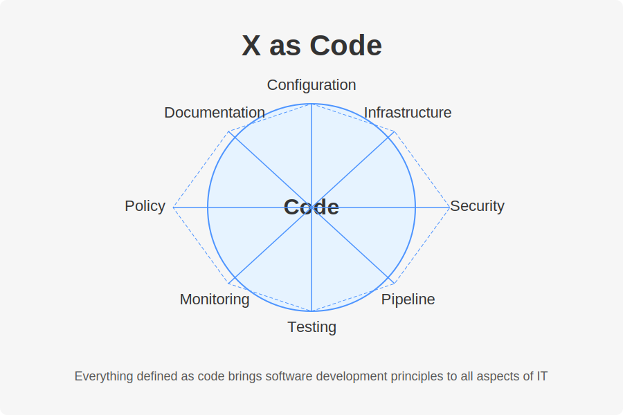

# 2. Why Infrastructure as Code 📦

[<- Back: Overview of IaC](./01-overview-of-iac.md) | [Next: IaC and Configuration Management Tools ->](./03-iac-configuration-management-tools.md)

## Table of Contents

- [Ways to Work with Cloud Services](#ways-to-work-with-cloud-services)
- [X as Code](#x-as-code)
- [Key Benefits of IaC](#key-benefits-of-iac)
- [The Disaster Scenario](#the-disaster-scenario)

## Ways to Work with Cloud Services

There are several approaches to managing cloud infrastructure, ranging from manual to fully automated:

| Method | Description | Pros | Cons |
|--------|-------------|------|------|
| **Console UI (ClickOps)** | Using the cloud provider's web interface | Easy to learn, good for experimentation | Not scalable, prone to human error, not reproducible |
| **CLI / API** | Using command-line tools or direct API calls | More automation potential, scriptable | Script maintenance, difficult to track state |
| **SDK/CDK** | Using software/cloud development kits in programming languages | Integrates with development workflows, powerful | Requires coding skills, potential overhead |
| **IaC** | Using declarative infrastructure frameworks | Consistent, reproducible, version-controlled | Learning curve, overhead for simple tasks |

As we move down this list:
- The learning curve becomes steeper
- Initial time investment increases
- But long-term benefits and scalability improve dramatically

## X as Code

The "X as Code" concept extends beyond just infrastructure:

Modern DevOps practices aim to define various aspects of systems as code:

- **Infrastructure as Code**: Servers, networks, storage
- **Configuration as Code**: Application settings, system configs
- **Security as Code**: Security policies, compliance rules
- **Policy as Code**: Organizational rules and governance
- **Pipeline as Code**: CI/CD processes
- **Documentation as Code**: System documentation

This approach brings software development principles to all aspects of IT operations.

## Key Benefits of IaC

IaC provides numerous advantages that justify its adoption:

1. **Version Control**: Track changes, add comments, collaborate
2. **Automation**: Eliminate manual processes
3. **Collaboration**: Enable team-based infrastructure management
4. **Sandboxing**: Test infrastructure changes safely
5. **Testability**: Validate infrastructure before deployment
6. **Reproducibility**: Solve the "works on my machine" problem
7. **Recoverability**: Rebuild infrastructure after failures
8. **Idempotency**: Apply the same configuration repeatedly with predictable results

## The Disaster Scenario

Consider what would happen if your entire infrastructure were suddenly destroyed:

- How prepared is your organization for this scenario?
- How long would it take to recover?
- What would be the business impact during recovery?

Without IaC, companies might struggle to recreate years of infrastructure work quickly enough to prevent devastating business losses. 

In a disaster recovery situation, IaC allows you to:

1. Check out your infrastructure code from version control
2. Run your IaC tools against your cloud provider
3. Recreate your entire environment in a predictable, automated way

This capability transforms a potential business-ending disaster into a manageable incident with clear recovery procedures.

---

[<- Back: Overview of IaC](./01-overview-of-iac.md) | [Next: IaC and Configuration Management Tools ->](./03-iac-configuration-management-tools.md)