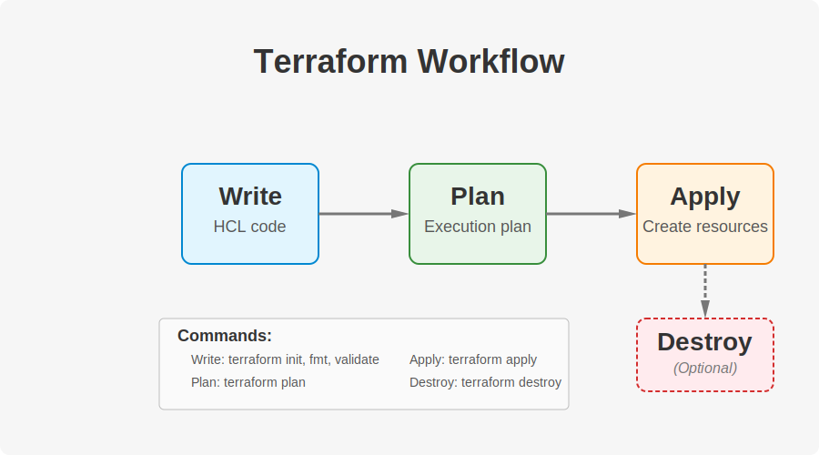

# 5. Terraform: Getting Started 🚀

[<- Back: Imperative vs Declarative Approaches](./04-imperative-vs-declarative.md) | [Next: Terraform: Hands-On ->](./06-terraform-hands-on.md)

## Table of Contents

- [Installation and Setup](#installation-and-setup)
- [Azure CLI Setup](#azure-cli-setup)
- [Creating Your First Terraform Project](#creating-your-first-terraform-project)
- [Terraform Workflow](#terraform-workflow)
- [Core Terraform Commands](#core-terraform-commands)
- [Terraform File Types](#terraform-file-types)
- [Best Practices for Version Control](#best-practices-for-version-control)

## Installation and Setup

### Installing Terraform

1. Download Terraform from the official website: https://developer.hashicorp.com/terraform/install

2. Verify the installation by running:
   ```bash
   terraform --version
   ```

### Helpful Setup Tips

#### Tab Completion

Enable tab completion for your shell:
```bash
terraform -install-autocomplete
```

#### Terraform Alias

Create an alias to save typing time:

**For Unix/Linux/macOS**:
```bash
echo 'alias tf="terraform"' >> ~/.bashrc  # or ~/.zshrc
source ~/.bashrc  # or source ~/.zshrc
```

**For Windows (PowerShell)**:
```powershell
if (!(Test-Path -Path $PROFILE)) { New-Item -ItemType File -Path $PROFILE -Force }
Add-Content -Path $PROFILE -Value 'Set-Alias -Name tf -Value terraform'
```

## Azure CLI Setup

Since we'll be working with Azure, we need to set up the Azure CLI:

1. Install the Azure CLI from https://docs.microsoft.com/en-us/cli/azure/install-azure-cli

2. Log in to your Azure account:
   ```bash
   az login
   ```

3. Verify your login:
   ```bash
   az account show
   ```

### How Terraform Uses Azure CLI

While you can provision resources directly with the Azure CLI, Terraform works differently:

1. Terraform uses `az` to generate a user token for authorization
2. This token is used to authenticate against the Azure REST API
3. Terraform then makes API calls to create/modify/delete resources

## Creating Your First Terraform Project

1. Create a new directory for your project:
   ```bash
   mkdir my-terraform-project
   cd my-terraform-project
   ```

2. Initialize Terraform:
   ```bash
   terraform init
   ```
   
   Note: This will fail initially because we need a configuration file.

3. Create a minimal `main.tf` file:
   ```hcl
   # Empty configuration file
   ```

4. Run init again:
   ```bash
   terraform init
   ```

## Terraform Workflow

The Terraform workflow consists of several stages:



### 1. Write

Create infrastructure definitions in `.tf` files using HashiCorp Configuration Language (HCL).

### 2. Plan

Terraform creates an execution plan by comparing your code to the current state of your infrastructure.

### 3. Apply

Terraform executes the plan to create, update, or delete resources.

### 4. Destroy (Optional)

When needed, Terraform can tear down the resources defined in your configuration.

## Core Terraform Commands

| Command | Phase | Description |
|---------|-------|-------------|
| `terraform init` | Prepare | Initializes a Terraform working directory, downloads providers |
| `terraform fmt` | Prepare | Formats the Terraform files for consistent style |
| `terraform validate` | Prepare | Checks if the configuration is syntactically valid |
| `terraform plan` | Plan | Creates an execution plan |
| `terraform apply` | Apply | Executes the plan to create/modify infrastructure |
| `terraform show` | Inspect | Displays the current state or a plan |
| `terraform destroy` | Destroy | Removes all resources managed by the configuration |
| `terraform refresh` | Inspect | Updates the local state file against real resources |
| `terraform output` | Inspect | Shows output values from your root module |

### Planning and Applying

A typical workflow involves:

```bash
terraform plan    # Preview changes
terraform apply   # Apply changes (will ask for confirmation)
```

Look for this confirmation at the end of a successful apply:
```
Apply complete! Resources: X added, Y changed, Z destroyed.
```

### Destroying Resources

When you need to tear down infrastructure:

```bash
terraform destroy
```

Terraform will handle the dependency graph to ensure resources are destroyed in the correct order.

## Terraform File Types

| File | Purpose |
|------|---------|
| `*.tf` | Infrastructure definitions in HCL |
| `*.tf.json` | Infrastructure definitions in JSON format |
| `*.tfvars`, `*.tfvars.json` | Variable definitions for configurations |
| `.terraform.lock.hcl` | Tracks provider versions and dependencies |
| `terraform.tfstate` | Current state of your managed infrastructure |
| `terraform.tfstate.backup` | Backup of the previous state |
| `outputs.tf` | Conventionally used to define output values |
| `variables.tf` | Conventionally used to define input variables |

## Best Practices for Version Control

When using Git or another VCS with Terraform:

1. **Add Terraform-specific entries to your `.gitignore`**:
   ```
   # Local .terraform directories
   **/.terraform/*

   # .tfstate files
   *.tfstate
   *.tfstate.*

   # Crash log files
   crash.log

   # Sensitive variable files
   *.tfvars
   ```

2. **Commit these files**:
   - `*.tf` files
   - `.terraform.lock.hcl`
   - Non-sensitive `*.tfvars` files used by the team

3. **Don't commit**:
   - `.terraform/` directory (contains large provider binaries)
   - State files (contain sensitive information)
   - Secret variable files

4. **Use a shared state backend** in real-world projects (covered in a later section)

---

[<- Back: Imperative vs Declarative Approaches](./04-imperative-vs-declarative.md) | [Next: Terraform: Hands-On ->](./06-terraform-hands-on.md)