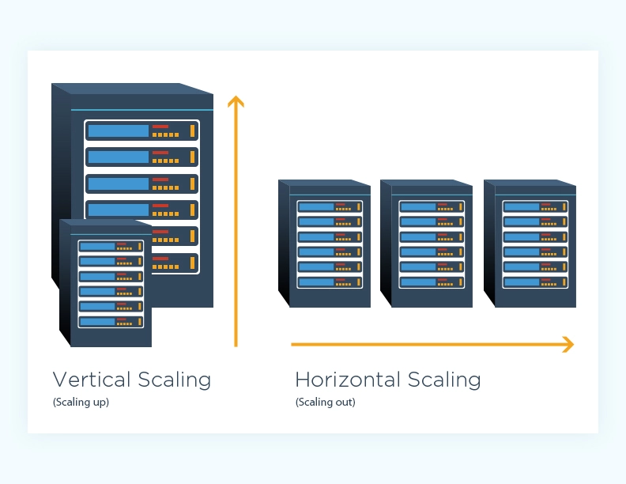
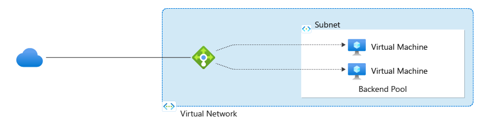

# 4. Orchestration Fundamentals 🔄

[<- Back: Deployment Strategies](./03-deployment-strategies.md) | [Next: Kubernetes ->](./05-kubernetes.md)

## Table of Contents

- [Introduction](#introduction)
- [Fault Tolerance Through Redundancy](#fault-tolerance-through-redundancy)
- [Scalability Approaches](#scalability-approaches)
- [Load Balancing](#load-balancing)
- [High Availability Design](#high-availability-design)
- [Advanced Orchestration Platforms](#advanced-orchestration-platforms)
- [Summary](#summary)

## Introduction

Orchestration refers to the automated arrangement, coordination, and management of complex computer systems, middleware, and services. As applications become more distributed and containerized, orchestration becomes essential for managing these components at scale. It addresses critical operational challenges: ensuring fault tolerance, managing scalability, handling network congestion, and providing high availability.

## Fault Tolerance Through Redundancy

Fault tolerance is the property that enables a system to continue operating properly in the event of failures in one or more of its components.

### Redundancy Principles

Redundancy involves duplicating critical components to provide backup if one fails. Natural examples include:

- The human body with paired organs (kidneys, lungs, eyes)
- Aircraft with multiple engines and redundant control systems
- Power grids with multiple generation sources and transmission paths

### Types of Redundancy in Systems

1. **Hardware Redundancy**: Multiple physical machines performing the same function
2. **Geographic Redundancy**: Services deployed across multiple data centers or regions
3. **Network Redundancy**: Multiple network paths between components
4. **Data Redundancy**: Multiple copies of data across different storage systems

### Implementation Example

```javascript
// Example AWS architecture with redundancy
resource "aws_instance" "web" {
  count = 3  // Create 3 identical web servers
  ami           = "ami-0c55b159cbfafe1f0"
  instance_type = "t2.micro"
  
  // Distribute across availability zones
  availability_zone = element(["us-west-2a", "us-west-2b", "us-west-2c"], count.index)
  
  tags = {
    Name = "web-server-${count.index}"
  }
}

// Define a load balancer that distributes traffic to all instances
resource "aws_lb" "web" {
  name               = "web-lb"
  internal           = false
  load_balancer_type = "application"
  subnets            = aws_subnet.public.*.id
}
```

### Design Considerations

- **N+1 Redundancy**: Provide one more component than the minimum required
- **N+2 Redundancy**: Provide two more components than required (greater resilience)
- **2N Redundancy**: Fully duplicate the entire system for maximum resilience
- **Shared vs. Dedicated Redundancy**: Determine whether backup components are dedicated to specific primaries or shared among multiple primaries

## Scalability Approaches

Scalability is the capability of a system to handle a growing amount of work or its potential to accommodate growth.

### Vertical Scaling (Scaling Up)

Adding more power to existing machines:

- Increasing CPU cores or speed
- Adding more memory
- Upgrading to faster storage
- Using specialized hardware accelerators

**Advantages:**
- Simpler to implement
- No additional networking complexity
- Better for applications not designed for distribution
- Lower software licensing costs (in some cases)

**Disadvantages:**
- Limited by maximum hardware capacity
- Often requires downtime for upgrades
- Creates larger single points of failure
- Usually more expensive per unit of capacity

### Horizontal Scaling (Scaling Out)

Adding more machines to distribute the load:

- Running multiple instances of an application
- Distributing across multiple servers
- Adding more nodes to a cluster
- Spreading across multiple availability zones or regions

**Advantages:**
- Virtually unlimited scaling potential
- No single point of failure (with proper design)
- Can use commodity hardware (lower cost per unit)
- Allows for rolling updates with no downtime
- Can scale dynamically based on demand

**Disadvantages:**
- More complex to implement
- Requires distributed application architecture
- Introduces network communication overhead
- May increase licensing costs (per-instance licenses)
- Requires load balancing and orchestration



### Comparison

| Aspect | Vertical Scaling | Horizontal Scaling |
|--------|------------------|-------------------|
| Implementation Complexity | Lower | Higher |
| Maximum Capacity | Limited by largest available hardware | Virtually unlimited |
| Downtime for Scaling | Often required | Not required (with proper design) |
| Cost Efficiency | Decreases at larger scales | Increases at larger scales |
| Application Architecture | Works with legacy applications | Requires distributed design |
| Fault Tolerance | Lower (single server) | Higher (multiple servers) |

## Load Balancing

Load balancing distributes network traffic across multiple servers to ensure no single server bears too much demand. This improves response times and prevents any single server from becoming a bottleneck.



### Types of Load Balancers

1. **Hardware Load Balancers**: Physical devices specialized for traffic distribution
2. **Software Load Balancers**: Applications running on standard servers (e.g., Nginx, HAProxy)
3. **DNS Load Balancing**: Using DNS to distribute requests across multiple IP addresses
4. **Layer 4 (Transport) Load Balancing**: Distribution based on IP address and port
5. **Layer 7 (Application) Load Balancing**: Distribution based on application-specific data (HTTP headers, cookies, etc.)

### Load Balancing Algorithms

- **Round Robin**: Requests are distributed sequentially across servers
- **Least Connections**: Requests go to the server with fewest active connections
- **Least Response Time**: Requests go to the server with quickest response time
- **IP Hash**: Client IP determines which server receives the request (session persistence)
- **Weighted Methods**: Some servers receive proportionally more traffic based on capacity

### Nginx Example

```nginx
http {
    upstream backend {
        server backend1.example.com;
        server backend2.example.com;
        server backend3.example.com;
    }

    server {
        listen 80;
        
        location / {
            proxy_pass http://backend;
        }
    }
}
```

### Advanced Configuration with Weighting and Health Checks

```nginx
upstream backend {
    # Define weight for proportional traffic distribution
    server backend1.example.com weight=3;  # Gets 3x traffic
    server backend2.example.com weight=1;  # Gets 1x traffic
    
    # Health checks and timeout configuration
    server backend3.example.com max_fails=3 fail_timeout=30s;
    
    # Server marked as backup will only receive requests when others fail
    server backup.example.com backup;
}
```


## High Availability Design

High Availability (HA) refers to systems designed to operate continuously without failure for a long time. The goal is to avoid single points of failure and provide reliable service despite hardware or software issues.

### Key Components

1. **Redundant Infrastructure**: Multiple servers, network paths, power supplies
2. **Automated Failover**: System automatically switches to redundant components when failures occur
3. **Load Balancing**: Distributes load and provides failover capability
4. **Health Monitoring**: Continuously checks system components
5. **Data Replication**: Ensures data availability across components

### Keepalived Example

Keepalived is a tool that provides high availability by implementing VRRP (Virtual Router Redundancy Protocol). It manages a virtual IP address that floats between servers:

```bash
# Example Keepalived configuration for high availability
vrrp_instance VI_1 {
    state MASTER
    interface eth0
    virtual_router_id 51
    priority 100
    authentication {
        auth_type PASS
        auth_pass mypassword
    }
    virtual_ipaddress {
        192.168.1.100
    }
    track_script {
        chk_haproxy
    }
}

vrrp_script chk_haproxy {
    script "killall -0 haproxy"
    interval 2
    weight 2
}
```

### High Availability Architecture

A typical HA architecture includes:

1. **Load Balancers** (in pairs for redundancy)
2. **Application Servers** (multiple instances)
3. **Database Clusters** (with primary/replica setup)
4. **Shared Storage** (replicated across locations)
5. **Monitoring Systems** (to detect failures)

## Advanced Orchestration Platforms

As systems grow more complex, specialized orchestration platforms become necessary to manage the growing complexity.

### Leading Orchestration Platforms

1. **Kubernetes**: The dominant container orchestration platform (detailed in the next section)
2. **Docker Swarm**: Docker's native clustering and scheduling tool
3. **Apache Mesos**: Distributed systems kernel that abstracts resources across data centers
4. **HashiCorp Nomad**: Flexible workload orchestrator that can handle containers and non-containerized applications
5. **Red Hat OpenShift**: Enterprise Kubernetes platform with additional features

### Key Capabilities

Modern orchestration platforms provide:

- **Automated Deployment**: Placing workloads on appropriate infrastructure
- **Scaling**: Adjusting resources based on demand
- **Load Balancing**: Distributing traffic across instances
- **Service Discovery**: Helping components find each other
- **Health Monitoring**: Detecting and responding to failures
- **Rolling Updates**: Upgrading components with minimal disruption
- **Self-Healing**: Automatically recovering from failures

### Selection Considerations

When choosing an orchestration platform, consider:

- **Scale Requirements**: Some platforms are better suited for larger deployments
- **Complexity Tolerance**: Platforms differ in learning curve and operational overhead
- **Integration Needs**: Compatibility with existing systems and tools
- **Team Expertise**: Available skills and training requirements
- **Application Architecture**: Container-native vs. traditional applications

## Summary

Orchestration fundamentals provide the building blocks for reliable, scalable systems:

1. **Fault tolerance** through redundancy eliminates single points of failure by duplicating critical components.

2. **Scalability approaches** involve either vertical scaling (bigger machines) or horizontal scaling (more machines), each with different trade-offs.

3. **Load balancing** distributes traffic across multiple instances to improve performance and reliability.

4. **High availability design** combines redundancy, failover, and monitoring to ensure continuous operation.

5. **Advanced orchestration platforms** bring these concepts together into comprehensive solutions for managing complex distributed systems.

Understanding these fundamentals provides the foundation for exploring Kubernetes, the most widely-adopted container orchestration platform, in the next section.

---

[<- Back: Deployment Strategies](./03-deployment-strategies.md) | [Next: Kubernetes ->](./05-kubernetes.md)