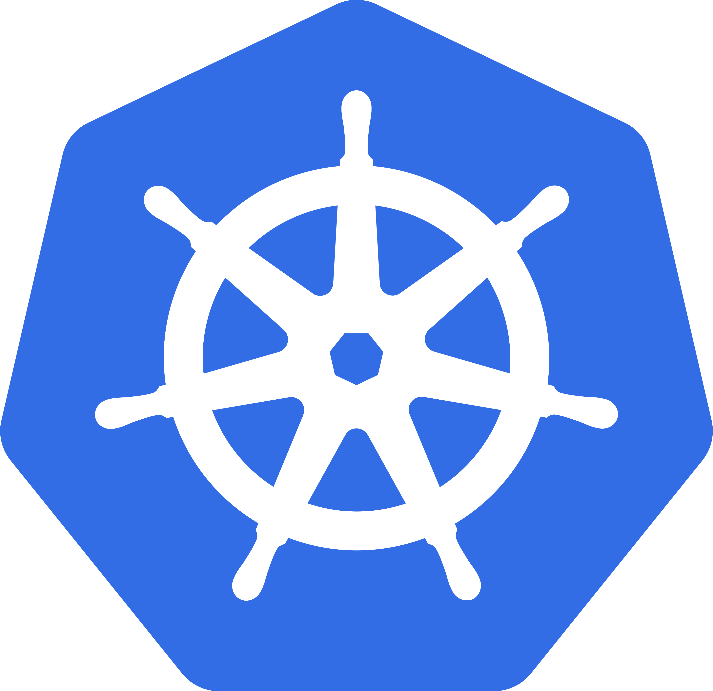
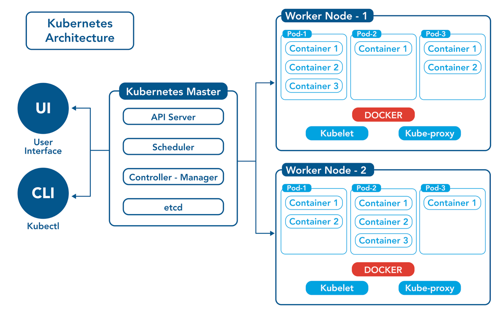
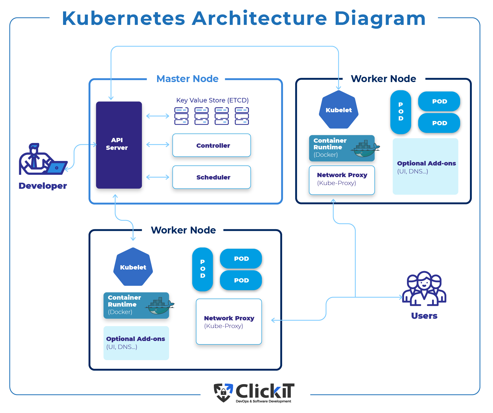
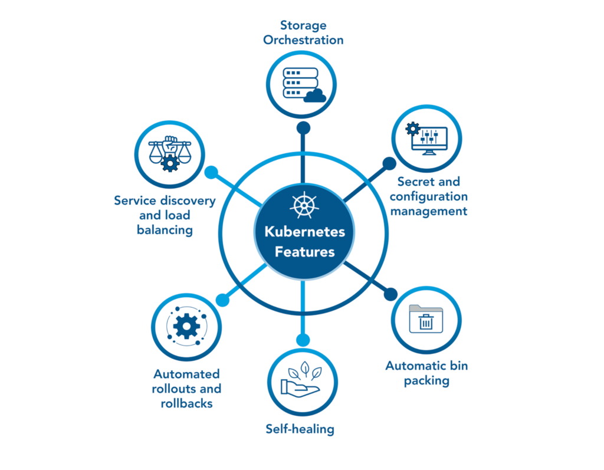

# 5. Kubernetes 🛡️

[<- Back: Orchestration Fundamentals](./04-orchestration.md) | [Next: Kubernetes Hands-On ->](./06-kubernetes-hands-on.md)

## Table of Contents

- [Introduction](#introduction)
- [Core Concepts and Architecture](#core-concepts-and-architecture)
- [Key Features and Benefits](#key-features-and-benefits)
- [Kubernetes Components](#kubernetes-components)
- [Kubernetes in Production](#kubernetes-in-production)
- [Challenges and Limitations](#challenges-and-limitations)
- [When to Use Kubernetes](#when-to-use-kubernetes)
- [Summary](#summary)

## Introduction

Kubernetes (often abbreviated as K8s) is an open-source platform designed to automate deploying, scaling, and operating containerized applications. Originally developed by Google based on their internal Borg system, Kubernetes has become the de facto standard for container orchestration.



At its core, Kubernetes aims to provide a "platform for platforms" that abstracts away the complexity of managing individual containers across a cluster of machines. It handles many critical aspects of running distributed applications, including deployment, scaling, load balancing, logging, and monitoring.

Google runs several billions of containers weekly in Google Cloud, demonstrating the scale at which Kubernetes can operate when properly implemented.

## Core Concepts and Architecture

Kubernetes follows a master-node architecture with several key components working together:



### Cluster Architecture

A Kubernetes cluster consists of:

1. **Control Plane (Master)**: Manages the cluster
   - API Server: Entry point for all REST commands
   - etcd: Distributed key-value store for cluster data
   - Scheduler: Assigns workloads to nodes
   - Controller Manager: Maintains desired state
   - Cloud Controller Manager: Interfaces with cloud providers

2. **Nodes (Workers)**: Run containerized applications
   - kubelet: Ensures containers are running in a Pod
   - kube-proxy: Maintains network rules
   - Container Runtime: Software for running containers (e.g., Docker, containerd, CRI-O)



### Key Objects and Resources

Kubernetes organizes its resources in a hierarchical model:

- **Pod**: The smallest deployable unit containing one or more containers that share network and storage
- **ReplicaSet**: Ensures a specified number of pod replicas are running
- **Deployment**: Manages ReplicaSets and provides declarative updates
- **Service**: An abstract way to expose an application running on a set of Pods
- **Namespace**: Virtual cluster for resource isolation
- **ConfigMap and Secret**: Environment-specific configuration
- **PersistentVolume**: Storage abstraction

## Key Features and Benefits

Kubernetes provides numerous capabilities that address common challenges in running containerized applications:



### Auto-scaling

Kubernetes can automatically scale applications based on:

- **Horizontal Pod Autoscaler**: Adjusts the number of pods based on CPU utilization or other metrics
- **Vertical Pod Autoscaler**: Adjusts the resource requests/limits for pods
- **Cluster Autoscaler**: Adjusts the number of nodes in the cluster

```yaml
# Example Horizontal Pod Autoscaler
apiVersion: autoscaling/v2
kind: HorizontalPodAutoscaler
metadata:
  name: example-hpa
spec:
  scaleTargetRef:
    apiVersion: apps/v1
    kind: Deployment
    name: example-deployment
  minReplicas: 2
  maxReplicas: 10
  metrics:
  - type: Resource
    resource:
      name: cpu
      target:
        type: Utilization
        averageUtilization: 50
```

### Monitoring and Health Checks

Kubernetes continuously monitors the health of applications:

- **Liveness Probes**: Determine if a container is running
- **Readiness Probes**: Determine if a container is ready to accept traffic
- **Startup Probes**: Determine if an application has started

Additionally, the Kubernetes Dashboard provides a built-in UI for monitoring cluster state.

### Automated Deployment

Kubernetes enables sophisticated deployment patterns:

- **Rolling Updates**: Gradually replace old pods with new ones
- **Blue-Green Deployments**: Run two identical environments and switch between them
- **Canary Deployments**: Test new versions with a subset of traffic

### Self-healing

When containers fail, Kubernetes automatically replaces them:

- Restarts containers that fail health checks
- Replaces pods when nodes become unhealthy
- Kills containers that exceed resource limits
- Prevents traffic from being sent to unready pods

## Kubernetes Components

Let's explore the critical components of Kubernetes in more detail:

### Pods

Pods are the atomic unit of deployment in Kubernetes:

- Can contain one or more containers
- Share network namespace (same IP address and port space)
- Share storage volumes
- Have a defined lifecycle (pending, running, succeeded, failed, unknown)

```yaml
# Simple Pod definition
apiVersion: v1
kind: Pod
metadata:
  name: nginx-pod
  labels:
    app: nginx
spec:
  containers:
  - name: nginx
    image: nginx:1.21
    ports:
    - containerPort: 80
    resources:
      limits:
        memory: "128Mi"
        cpu: "500m"
```

### Services

Services provide stable networking for pods:

- **ClusterIP**: Internal-only IP accessible within the cluster
- **NodePort**: Exposes the service on each Node's IP at a static port
- **LoadBalancer**: Exposes the service externally using a cloud provider's load balancer
- **ExternalName**: Maps to an external DNS name

### Deployments

Deployments manage the creation and scaling of pods:

- Provide declarative updates for Pods and ReplicaSets
- Define desired state, and controllers change actual state to match
- Support rolling updates and rollbacks
- Track revision history

### Namespaces

Namespaces provide a mechanism for isolating groups of resources within a cluster:

- Virtual clusters backed by the same physical cluster
- Scope for names (resources must be unique within a namespace)
- Way to divide cluster resources between multiple users or projects

## Kubernetes in Production

Running Kubernetes in production environments introduces additional considerations:

### Cloud Provider Options

Major cloud providers offer managed Kubernetes services:

- **Google Kubernetes Engine (GKE)**
- **Amazon Elastic Kubernetes Service (EKS)**
- **Azure Kubernetes Service (AKS)**
- **IBM Cloud Kubernetes Service**
- **DigitalOcean Kubernetes**

These services handle control plane management, often at no additional charge beyond the cost of worker nodes.

### Configuration Management

Production Kubernetes clusters require sophisticated configuration management:

- **Resource Management**: Setting appropriate CPU and memory requests/limits
- **Pod Disruption Budgets**: Ensuring high availability during voluntary disruptions
- **Affinity and Anti-Affinity Rules**: Controlling pod placement
- **Network Policies**: Defining communication rules between pods
- **Security Contexts**: Restricting container privileges

### Monitoring and Observability

Comprehensive monitoring is essential:

- **Prometheus**: Monitoring and alerting
- **Grafana**: Visualization and dashboards
- **Elastic Stack**: Logging and analysis
- **Jaeger/Zipkin**: Distributed tracing

## Challenges and Limitations

Despite its benefits, Kubernetes introduces significant complexity:

### Operational Challenges

| Challenge | Description |
|-----------|-------------|
| Meeting isolation standards | Ensuring proper security isolation between applications |
| Internal networking complexity | Managing service-to-service communication and latency |
| Limited resource visibility | Tracking resource utilization across many applications |
| Resource optimization | Balancing cost and performance in large clusters |
| Deployment failovers | Implementing reliable update strategies |
| Data flow visibility | Maintaining visibility as the cluster grows |
| Patch management | Updating Kubernetes components without disruption |
| Access management | Implementing proper RBAC and multi-tenancy |
| On-premise challenges | Managing physical infrastructure alongside Kubernetes |

### Cost Considerations

Kubernetes can introduce unexpected costs:

- **Cluster management overhead**: Administration time and expertise
- **Infrastructure costs**: Additional nodes for redundancy
- **Overprovisioning**: Reserved but unused resources
- **Learning curve**: Training and skill development
- **Third-party tools**: Additional components for monitoring, security, etc.

## When to Use Kubernetes

Kubernetes is not always the right solution:

### Good Use Cases

- Microservices architectures with many independent services
- Applications that need horizontal scaling
- Development teams that require standardized environments
- Organizations with large-scale container deployments
- Applications that need sophisticated deployment patterns

### Poor Use Cases

- Simple applications with few components
- Teams with limited operations expertise
- Small-scale deployments that don't justify the overhead
- Applications with specialized hardware requirements
- Budget-constrained projects without resources for proper implementation

### Alternatives to Consider

- **Docker Compose**: For simple multi-container applications
- **AWS ECS**: Simpler container orchestration
- **Platform as a Service (PaaS)**: Heroku, Google App Engine, etc.
- **Serverless**: AWS Lambda, Azure Functions, Google Cloud Functions

## Summary

Kubernetes represents a powerful solution for container orchestration, offering sophisticated capabilities for deploying, scaling, and managing containerized applications. Key takeaways include:

1. Kubernetes provides a robust platform for container orchestration with features like auto-scaling, self-healing, and sophisticated deployment strategies.

2. The architecture consists of control plane components that manage the cluster and nodes that run workloads, with resources organized in a hierarchical model.

3. While cloud providers offer managed Kubernetes services, running Kubernetes in production requires careful consideration of configuration, monitoring, and cost.

4. Despite its benefits, Kubernetes introduces significant complexity and may not be appropriate for all use cases. Always evaluate whether the capabilities justify the operational overhead.

Remember: Just because large tech companies use Kubernetes doesn't mean every organization needs it. Choose the right level of complexity for your specific requirements and team capabilities.

In the next section, we'll get hands-on experience with Kubernetes using Minikube, a tool for running Kubernetes locally.

---

[<- Back: Orchestration Fundamentals](./04-orchestration.md) | [Next: Kubernetes Hands-On ->](./06-kubernetes-hands-on.md)
