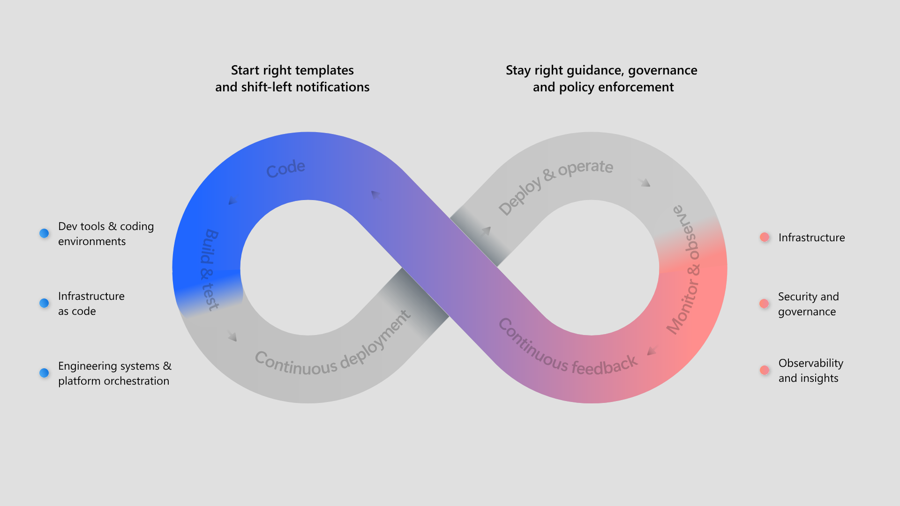
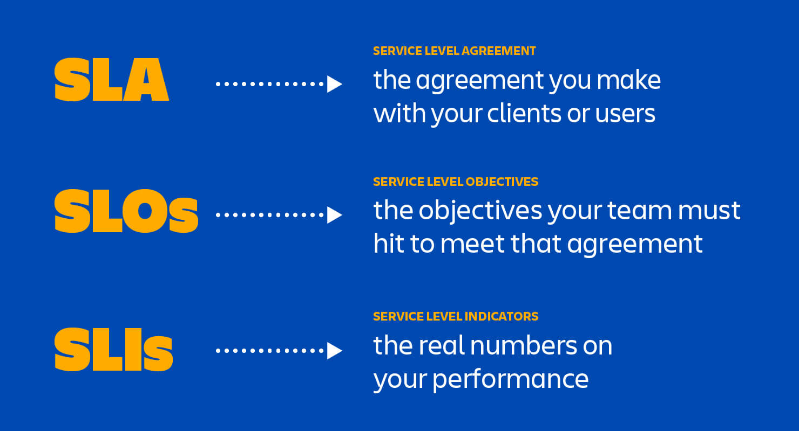
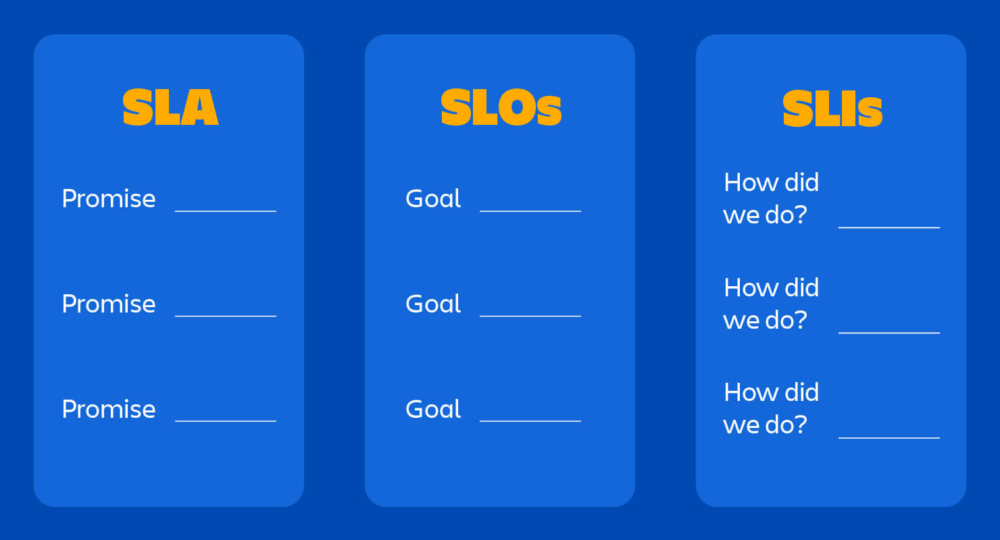

# 8. Maintenance Best Practices 💡

[<- Back: System Resilience](./07-resilience.md) | [Next: Main Note ->](./README.md)

## Table of Contents

- [Introduction](#introduction)
- [The Scope of Maintenance](#the-scope-of-maintenance)
- [Designing for Maintainability](#designing-for-maintainability)
- [Service Level Agreements](#service-level-agreements)
- [Definition of Done in Operations](#definition-of-done-in-operations)
- [Maintenance Strategies](#maintenance-strategies)
- [Summary](#summary)

## Introduction

While creating software gets most of the attention in education and industry discussion, the majority of an application's lifecycle is spent in maintenance mode. Maintenance encompasses all activities required to keep a system operational, relevant, and effective after its initial deployment—often lasting years or even decades.



This section focuses on the critical but often overlooked aspects of system maintenance, exploring how to design for maintainability, establish clear service expectations, and implement effective maintenance processes.

## The Scope of Maintenance

Maintenance is far more than just "fixing bugs." It encompasses a broad range of activities:

### Bug Fixing

Addressing defects discovered after deployment:
- Regression issues
- Edge cases missed during testing
- Compatibility problems with new environments
- Security vulnerabilities

### Operational Support

Keeping systems running smoothly:
- Performance tuning
- Capacity planning
- Log analysis
- Backup and restore procedures
- Security patches and updates

### Adaptation

Modifying systems to work in changing environments:
- Supporting new client devices
- Adapting to updated dependencies
- Migrating to new platforms
- Accommodating infrastructure changes

### Evolution

Enhancing systems with new capabilities:
- Feature additions
- User experience improvements
- Integration with new systems
- Performance optimizations

### Technical Debt Management

Addressing accumulated implementation compromises:
- Refactoring for improved maintainability
- Updating outdated patterns or technologies
- Improving test coverage
- Enhancing documentation

## Designing for Maintainability

The ISO 25010 standard identifies several qualities that contribute to maintainability:

### Modularity

Designing systems with components that can be changed independently:
- Well-defined interfaces between components
- Minimal coupling between modules
- Single responsibility principle
- Encapsulation of implementation details

### Reusability

Creating components that can be used in multiple contexts:
- Generic, parameterized implementations
- Clear documentation of assumptions and requirements
- Consistent interfaces and patterns
- Appropriate abstraction levels

### Analyzability

Making it easy to diagnose problems:
- Comprehensive logging
- Monitoring and metrics
- Clear error messages
- Traceable execution paths
- Documentation of system behavior

### Modifiability

Enabling changes with minimal side effects:
- Clear separation of concerns
- Configurable behaviors
- Implementation hiding
- Dependency injection
- Feature flags

### Testability

Supporting verification of changes:
- Unit and integration tests
- Test automation
- Mockable interfaces
- Reproducible test scenarios
- Controllable test environments

### Kleppmann's Maintenance Design Principles

Martin Kleppmann, in "Designing Data-Intensive Applications," identifies three key aspects of designing for maintainability:

1. **Operability**: Making it easy for operations teams to keep the system running
   - Good monitoring and visibility
   - Effective support for automation
   - Standard operational procedures
   - Predictable behavior and defaults
   - Self-healing where possible
   - Minimal dependencies on other systems

2. **Simplicity**: Making it easy for new engineers to understand the system
   - Avoiding unnecessary complexity
   - Clear abstractions and models
   - Consistent naming and conventions
   - Thorough documentation
   - Minimizing special cases

3. **Evolvability**: Making it easy to make changes as requirements change
   - Extensible data models and interfaces
   - Incremental modification support
   - Backward compatibility
   - Feature toggles
   - Clear migration paths

## Service Level Agreements

Service Level Agreements (SLAs), Service Level Objectives (SLOs), and Service Level Indicators (SLIs) provide a structured approach to measuring and managing service quality.

### Key Definitions



- **SLI (Service Level Indicator)**: A metric that measures a specific aspect of service level
  - Example: Error rate, latency, throughput, availability percentage

- **SLO (Service Level Objective)**: A target value for an SLI over a period
  - Example: 99.9% availability over a month, p99 latency under 200ms

- **SLA (Service Level Agreement)**: A contract specifying what happens if SLOs aren't met
  - Example: Financial penalties, service credits, termination rights

### SLA Template Structure



A typical SLA includes:

1. **Service Description**: What is being provided
2. **Performance Standards**: The SLOs that must be met
3. **Measurement Methodology**: How SLIs are calculated
4. **Exclusions**: What circumstances are exempt (e.g., planned maintenance)
5. **Remedies**: What happens if standards aren't met
6. **Reporting**: How and when performance will be reported

### Examples of Real-World SLAs

Major cloud providers publish detailed SLAs for their services:

- **Microsoft Azure**: Different services have different uptime commitments (99.9% to 99.99%)
- **Google Cloud**: Offers tiered SLAs based on deployment architecture
- **AWS**: Provides service-specific SLAs with clear definitions of "downtime"

These SLAs typically define:
- Monthly uptime percentage calculations
- Service credit schedules for missed SLAs
- Claim processes
- Limitations and exclusions

### Implementing SLAs in Your Organization

To establish effective SLAs:

1. Start with collecting baseline metrics
2. Define SLIs that matter to your users
3. Set realistic SLOs based on historical performance
4. Create internal SLAs before external ones
5. Automate SLI measurement and reporting
6. Review and adjust regularly based on feedback

```javascript
// Example SLO/SLI monitoring in Prometheus
// Alert when error rate exceeds SLO threshold
alert: ErrorBudgetBurning
expr: |
  (
    sum(rate(http_requests_total{job="api",code=~"5.."}[1h]))
    /
    sum(rate(http_requests_total{job="api"}[1h]))
  ) > 0.001 # 0.1% error rate SLO
for: 5m
labels:
  severity: warning
annotations:
  summary: "Error budget burning too fast"
  description: "API error rate of {{ $value | humanizePercentage }} exceeds 0.1% SLO"
```

## Definition of Done in Operations

While development teams often have clear definitions of "done" for features, operations requires its own definition of when work is complete.

### Operational Definition of Done Components

A comprehensive operational definition of done might include:

1. **Deployment Criteria**
   - Successfully deployed to production
   - No deployment-related alerts triggered
   - Canary metrics within acceptable ranges
   - Zero-downtime achieved (if required)

2. **Observability Criteria**
   - Monitoring configured for new components
   - Dashboards updated
   - Log aggregation configured
   - Custom metrics implemented
   - Alerts tested

3. **Reliability Criteria**
   - Resilience testing completed
   - Chaos experiments run
   - Backup and restore procedures verified
   - Data migration verified (if applicable)
   - Rollback procedure documented and tested

4. **Documentation Criteria**
   - Architecture documentation updated
   - Runbooks created or updated
   - Known limitations documented
   - Troubleshooting guides available
   - Dependencies documented

5. **Operational Readiness**
   - On-call teams briefed
   - Support teams trained
   - Capacity planning completed
   - Performance baseline established
   - Security scanning completed

### Team-Specific Considerations

Each team may need to adapt their definition of done based on:
- The criticality of the system
- Regulatory requirements
- User expectations
- Available resources
- Team structure and responsibilities

## Maintenance Strategies

Different systems require different maintenance approaches:

### Preventive Maintenance

Regular activities to prevent problems:
- Scheduled updates and patches
- Capacity planning and scaling
- Regular security scanning
- Database optimization
- Log rotation and cleanup

### Corrective Maintenance

Addressing issues after they occur:
- Emergency fixes
- Bug resolution
- Security incident response
- Performance problem remediation

### Adaptive Maintenance

Keeping systems compatible with changing environments:
- Supporting new browsers or devices
- Updating for dependency changes
- Adapting to infrastructure changes
- Accommodating new integration requirements

### Perfective Maintenance

Improving existing functionality:
- Performance optimization
- User experience enhancement
- Code refactoring
- Documentation improvement

### The Maintenance Quadrant

Maintenance activities can be classified along two dimensions:
- **Reactive vs. Proactive**: Responding to issues vs. preventing them
- **Technical vs. Business**: Addressing technical concerns vs. business needs

```
                      PROACTIVE
                          │
                          │
           System         │        Feature
         Improvements     │       Planning
                          │
    TECHNICAL ────────────┼──────────── BUSINESS
                          │
           Incident       │        Feature
          Response        │        Requests
                          │
                          │
                      REACTIVE
```

### Maintenance Tooling

Effective maintenance relies on appropriate tools:

- **Monitoring Systems**: Prometheus, Grafana, Datadog
- **Log Management**: ELK Stack, Splunk, Graylog
- **Incident Management**: PagerDuty, OpsGenie, VictorOps
- **Knowledge Management**: Confluence, Wiki systems, Notion
- **Runbook Automation**: Rundeck, Ansible, custom scripts

## Summary

Maintenance represents the longest and often most challenging phase of a system's lifecycle. Key takeaways include:

1. Maintenance encompasses much more than bug fixing—it includes operational support, adaptation, evolution, and technical debt management.

2. Designing for maintainability requires attention to modularity, reusability, analyzability, modifiability, and testability, as well as Kleppmann's principles of operability, simplicity, and evolvability.

3. SLAs, SLOs, and SLIs provide a structured framework for defining, measuring, and managing service quality expectations.

4. An operational definition of done should include deployment, observability, reliability, documentation, and operational readiness criteria.

5. Different maintenance strategies—preventive, corrective, adaptive, and perfective—address different aspects of keeping systems healthy.

By approaching maintenance with the same rigor and attention applied to initial development, organizations can ensure their systems remain valuable, secure, and effective throughout their entire lifecycle.

---

[<- Back: System Resilience](./06-resilience.md) | [Next: Main Note ->](./README.md)
